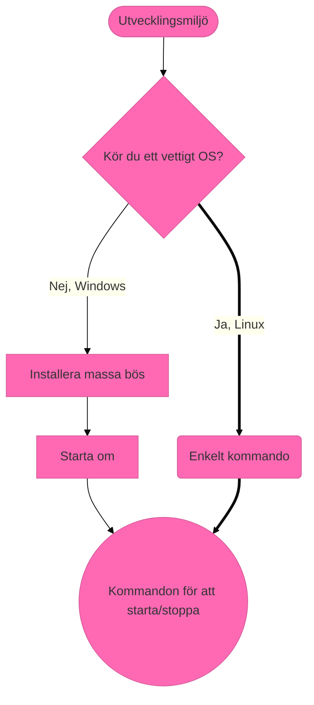

# Webbutveckling 1 - Kursplanering

Beskrivning av kursen, länk till skolverket, osv…

#### Modul 3 - Färglära

Länk till videogenomgång.

Länk till uppgift.

#### Modul 8 - Vektorgrafik 

8.0 Introduktion till Vektorgrafik 

8.1 Personligt varumärke 

8.2 Animera SVG 

## Installera Drupal

## Skolverkets riktlinjer

### HTML/CSS och bildhantering (40% av kursen)
* Kunskaper om de tekniker som används för att bygga webbplatser och webbapplikationer.
* Förmåga att bygga webbplatser och webbapplikationer enligt standarder och riktlinjer för god praxis samt med god tillgänglighet.
* Riktlinjer för god praxis inom webbutveckling.
* Märkspråk och deras inbördes roller, syntax och semantik – där det huvudsakliga innehållet är standarderna för HTML och CSS samt orientering om Ecmaskript och dokumentobjektsmodellen (DOM).
* Bilder och media med alternativa format, optimering och tillgänglighet.
### Projekt, process och testning (40% av kursen)
* Förmåga att planera, genomföra, testa, dokumentera och utvärdera utvecklingsprojekt för webbplatser samt applikationer som bygger på klientbaserade webbtekniker.
* Publikation av webbplatser med och utan webbpubliceringssystem.
* Processen för ett webbutvecklingsprojekt med målsättningar, planering, specifikation av struktur och design, kodning, optimering, testning, dokumentation och uppföljning.
* Interoperabilitet genom att följa standarder och testa på olika användaragenter.
* Applikationer som fungerar oberoende av val av användaragent, operativsystem eller hårdvaruplattform och hur tillgänglighet uppnås även för användare med funktionsnedsättning.
* Kvalitetssäkring av applikationens funktion och validering av kodens kvalitet.
### Allmänbildning och historik (16% av kursen)
* Kunskaper om webbens historia, betydelse och funktionalitet.
* Webben som plattform, dess historia och samhällspåverkan.
* Teknisk orientering om webbens protokoll, adresser, säkerhet och samspelet mellan klient och server.
* Teckenkodning, begrepp, standarder och handhavande.
* Förmåga att använda terminologi inom området.
* Terminologi inom området webbutveckling.
### Lagar (2% av kursen)
* Kunskaper om lagar och andra bestämmelser inom området samt förmåga att göra etiska överväganden och reflektera över integritetsfrågor.
* Lagar och andra bestämmelser som styr digital information, till exempel personuppgiftslagen och lagen om elektronisk kommunikation.
### Säkerhet (2% av kursen)
* Kunskaper om säkerhet och förmåga att identifiera och motarbeta attacker.
* Säkerhet och sätt att identifiera hot och sårbarheter samt hur attacker kan motverkas genom effektiva åtgärder. 

## Ikoner 
* Bok &#x1F4D7; / &#x1F4D8; / &#x1F4D9;
* Cirkel &#x1F534; / &#x1F535;
* Diamant &#x1F536; / &#x1F537; / &#x1F538; / &#x1F539;
* Pil Upp/Ned &#x1F53A; / &#x1F53B;
* Podcast &#x1f3a7; 
* Film &#x1f3ac; 
* Spel &#x1f3ae; 
* Vinnare &#x1f3c6; 
* Katalog Stängd/Öppen &#x1f4c1; / &#x1f4c2;
* Diskett &#x1f4be;
* Mobiltelefon &#x1f4f1; / &#x1f4f5;
* PC &#x1f4bb;
