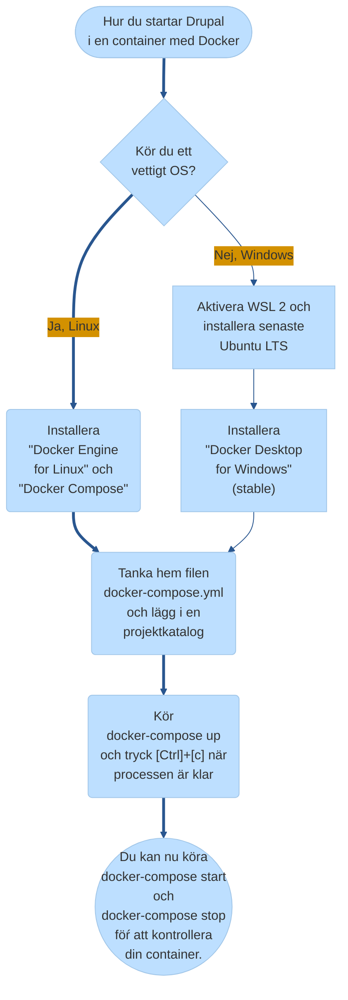

# Webbutveckling 1 - Kursplanering

Beskrivning av kursen, länk till skolverket, osv…

#### Modul 3 - Färglära

Länk till videogenomgång.

Länk till uppgift.

#### Modul 8 - Vektorgrafik 

8.0 Introduktion till Vektorgrafik 

8.1 Personligt varumärke 

8.2 Animera SVG 

## Installera Drupal

## Ikoner 
* Bok &#x1F4D7; / &#x1F4D8; / &#x1F4D9;
* Cirkel &#x1F534; / &#x1F535;
* Diamant &#x1F536; / &#x1F537; / &#x1F538; / &#x1F539;
* Pil Upp/Ned &#x1F53A; / &#x1F53B;
* Podcast &#x1f3a7; 
* Film &#x1f3ac; 
* Spel &#x1f3ae; 
* Vinnare &#x1f3c6; 
* Katalog Stängd/Öppen &#x1f4c1; / &#x1f4c2;
* Diskett &#x1f4be;
* Mobiltelefon &#x1f4f1; / &#x1f4f5;
* PC &#x1f4bb;
